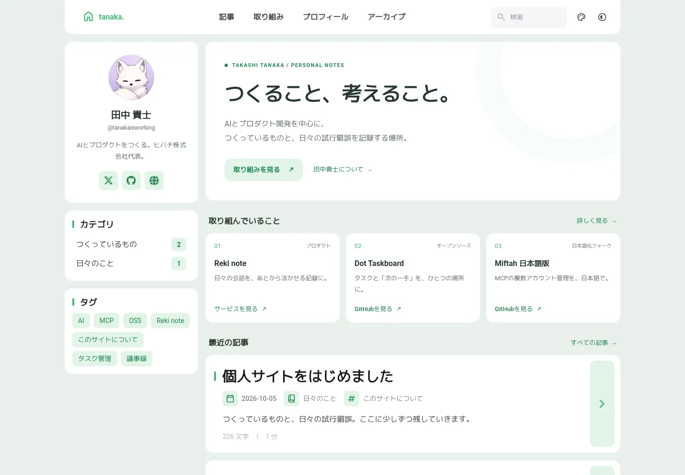

# tanaka. — 田中貴士の個人サイト

[Fuwari](https://github.com/saicaca/fuwari)をベースにした、日本語の個人サイトです。Astroの静的出力なので、データベース・APIキー・常駐サーバーは不要です。

トップ、取り組み、プロフィール、アーカイブ、記事詳細、検索、RSS、サイトマップ、404を用意しています。\n\n**公開URL:** https://profile.tanakaisworking.workers.dev

## プレビュー



[スマホ表示](docs/preview/mobile.webp) / [ダークモード](docs/preview/desktop-dark.webp)

## Cloudflare Pagesにデプロイ

Cloudflareの **Workers & Pages → Create application → Pages → Import an existing Git repository** から `tanakaisworking/personal-site` を選択します。非公開リポジトリなので、CloudflareのGitHub連携にこのリポジトリの読み取りを許可してください。

| 項目 | 設定 |
| --- | --- |
| Framework preset | Astro |
| Production branch | `main` |
| Build command | `pnpm build` |
| Build output directory | `dist` |
| Root directory | 空欄（リポジトリ直下） |
| Environment variable | `PNPM_VERSION` = `9.14.4` |
| Environment variable | `SITE_URL` = `https://profile.tanakaisworking.workers.dev` |

Node.jsは `.node-version` の `22.22.1` を利用します。Pagesの設定に別の `NODE_VERSION` がある場合は、削除するか同じ値にしてください。ProductionとPreviewの両方にpnpmバージョンを設定します。

`SITE_URL` はcanonical・OGP・RSS・サイトマップの基準です。このサイトでは `https://profile.tanakaisworking.workers.dev` を設定してください。独自ドメインへ変更するときは、そのURLに差し替えて再デプロイしてください。Previewにも本番の `SITE_URL` を設定すると、プレビューURLを正規URLとして扱わずに済みます。未設定ならCloudflareの `CF_PAGES_URL` を使うため初回ビルドはできますが、固定の本番URLを明示する運用を推奨します。サブディレクトリ設置には対応していません。

**Workers用アダプター、Functions、D1、Wrangler、デプロイトークンは不要です。** Pagesとして作成してください。GitHub Actionsは検証のみを行い、デプロイしません。

公式資料：[AstroのPagesデプロイ](https://developers.cloudflare.com/pages/framework-guides/deploy-an-astro-site/)、[ビルド環境とバージョン指定](https://developers.cloudflare.com/pages/configuration/build-image/)。

## 記事を増やす

GitHubのWeb画面で `src/content/posts/` に `.md` ファイルを追加できます。既存の記事をコピーして、タイトル・日付・本文を変更するだけでも更新できます。Pages連携後は `main` へのコミットで再デプロイされます。

```yaml
---
title: 記事のタイトル
published: 2026-10-05
description: 一覧や検索エンジンに表示する短い説明
tags: [AI, 開発ログ]
category: 開発ノート
draft: true
lang: ja
---

ここからMarkdownの本文。
```

`draft: true` の記事は本番ビルド・RSS・検索に含まれません。公開前に内容を確認し、`false` に変更します。非公開リポジトリでも、`draft: false` の内容はサイトに公開されます。未来の日付を指定するだけでは公開予約になりません。

ローカルでは次のコマンドで下書きを作成できます。slugは半角英数字とハイフンのみです。

```sh
pnpm new-post first-note "最初の開発メモ"
```

URLは `/posts/first-note/` になります。作成済みのファイルは上書きしません。日付は日本時間で作成します。コードブロック・画像・数式など、Fuwari標準のMarkdown機能も利用できます。画像は記事フォルダ内か `public/` に置けます。

## どこを編集するか

| 内容 | ファイル |
| --- | --- |
| サイト名・プロフィールの短文・SNSリンク・テーマ色 | `src/config.ts` |
| トップの見出しと紹介文 | `src/components/HomeIntro.astro` |
| 取り組みの一覧とリンク | `src/data/projects.ts` |
| プロフィール本文 | `src/content/spec/about.md` |
| 記事 | `src/content/posts/*.md` |
| 追加スタイル | `src/styles/personal.css` |
| 著者画像 | `src/assets/images/avatar.png` |
| ファビコン | `public/favicon.svg` |
| SNS共有画像 | `public/og.png`（生成元：`scripts/create-social-image.mjs`） |

記事3本と、非公開の開発ログ雛形を同梱しています。初期の紹介文は編集して使ってください。売上・利用者数・顧客情報・個人の連絡先・未公開ロードマップは掲載していません。

## ローカル開発と確認

```sh
corepack enable
pnpm install --frozen-lockfile
pnpm dev
```

検索は本番ビルド時にPagefindが索引をつくります。検索まで確認する場合は、開発サーバーではなく次を使います。

```sh
SITE_URL=https://personal-site.example pnpm check
SITE_URL=https://personal-site.example pnpm build
pnpm verify
pnpm preview --host 127.0.0.1
```

PowerShellでは `$env:SITE_URL='https://personal-site.example'` を先に実行してから、各コマンドを実行してください。ローカルで環境変数を指定しなければ `http://localhost:4321` が基準になります。`.env.example` は設定項目の見本であり、Astro設定ファイルが `.env` を自動で読む前提にはしていません。

`pnpm check` はAstro/TypeScript検査、`pnpm build` は静的サイトと検索索引生成、`pnpm verify` は生成ページ・ローカルリンク・下書き除外などの検証です。記事を全部消すとトップのページネーションを生成できなくなるため、公開記事は最低1本残してください。

## ライセンス・出典

Fuwari由来のコードはMIT Licenseです。元の `LICENSE` を保持しています。記事・プロフィール・独自画像にCCライセンスを自動適用していません。第三者の名前・ロゴ・画像にはそれぞれの権利があります。詳しくは [UPSTREAM.md](UPSTREAM.md) を参照してください。

## ブラウザでの回帰テスト

ChromiumとPython 3が利用できる環境では `pnpm test:browser` も実行できます。既定のChromiumパスは `/usr/bin/chromium` です。macOSなどでは `CHROME_PATH` にChromeの実行ファイルを指定してください。サイトの稼働や通常のビルドにはPythonもChromiumも不要です。

検証内容は [docs/verification.md](docs/verification.md) を参照してください。
